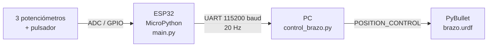

# Actividad 5 – Control de un brazo robótico (URDF) con ESP32 y Python

**Universidad Militar Nueva Granada – Ingeniería Mecatrónica**
**Asignatura:** Microcontroladores y Laboratorio
**Autor:** Bryan Andrey Martínez Montaño – Código 7004588

Una **ESP32 programada en MicroPython** lee tres potenciómetros y un pulsador, y envía los datos por **UART (USB-Serial)** a un script de **Python** que mueve en tiempo real el brazo robótico del archivo `brazo.urdf`, simulado en **PyBullet**.
El modelo URDF proviene del repositorio del curso [U_Militar / 8) Brazo_URDF](https://github.com/dialejobv/U_Militar/tree/main/8%29%20Brazo_URDF).

## 🎥 Video del funcionamiento

[](https://youtu.be/6_xxXOiI8eE)

▶️ **[Ver video del funcionamiento en físico](https://youtu.be/6_xxXOiI8eE)**

---

## 1. Arquitectura del sistema



1. La ESP32 lee los sensores, filtra el ruido y arma una trama de texto con checksum.
2. La trama se envía por el cable USB cada 50 ms.
3. En el PC, un hilo lee el puerto serial y valida cada trama.
4. Cada lectura ADC se convierte al rango de su articulación (límites leídos del URDF) y el robot se mueve con control de posición.

---

## 2. Archivos

| Archivo | Descripción |
| --- | --- |
| `main.py` | Código MicroPython de la ESP32: lectura de sensores y envío por UART. |
| `control_brazo.py` | Script de Python: recibe los datos y controla el brazo en PyBullet. |
| `brazo.urdf` | Modelo del robot entregado por el profesor. |
| `requirements.txt` | Librerías de Python necesarias. |
| `evidencias/` | Capturas de pantalla del funcionamiento. |

---

## 3. Modelo URDF

| Articulación | Tipo | Eje | Rango | Control |
| --- | --- | --- | --- | --- |
| `joint_1` | Rotacional | Z | −2.5 a 2.5 rad | Potenciómetro 1 |
| `joint_2` | Rotacional | Y | −2.0 a 2.0 rad | Potenciómetro 2 |
| `joint_gripper` | Prismática | Z | 0 a 0.15 m | Potenciómetro 3 |
| `joint_dedo_izq` | Prismática | −X | 0 a 0.05 m | Pulsador |
| `joint_dedo_der` | Prismática | X | 0 a 0.05 m | Pulsador |

Los límites no están escritos en el código: se leen del URDF con `p.getJointInfo()`.

---

## 4. Conexiones

| Componente | Pin ESP32 | Conexión |
| --- | --- | --- |
| Potenciómetro 1 (base) | GPIO 34 | Extremos a 3V3 y GND, pata central al GPIO |
| Potenciómetro 2 (hombro) | GPIO 35 | Extremos a 3V3 y GND, pata central al GPIO |
| Potenciómetro 3 (pinza) | GPIO 32 | Extremos a 3V3 y GND, pata central al GPIO |
| Pulsador | GPIO 25 | Entre el GPIO y GND (pull-up interno) |
| LED integrado | GPIO 2 | Encendido = pinza cerrada |

Se usan pines del **ADC1** porque el ADC2 deja de funcionar cuando se activa el WiFi.

---

## 5. Código de la ESP32 (`main.py`)

- **Lectura ADC:** atenuación de 11 dB para el rango 0–3.3 V; `read_u16() >> 4` lleva la lectura a 12 bits (0–4095).
- **Filtrado:** promedio de 16 muestras por lectura y una zona muerta de 15 cuentas para que el robot no tiemble con el potenciómetro quieto.
- **Pulsador:** detección de flanco de bajada con antirrebote de 200 ms; cada pulsación alterna abrir/cerrar la pinza.
- **Periodo fijo:** `time.ticks_add()` mantiene el envío estable en 20 Hz.

**Trama UART:**

```
$B,<seq>,<pot1>,<pot2>,<pot3>,<pinza>*<CS>
```

| Campo | Significado |
| --- | --- |
| `seq` | Contador 0–9999 para detectar paquetes perdidos |
| `pot1..pot3` | Lecturas ADC filtradas (0–4095) |
| `pinza` | 0 = abierta, 1 = cerrada |
| `CS` | Checksum XOR en hexadecimal de lo que está entre `$` y `*` |

---

## 6. Script de Python (`control_brazo.py`)

1. Carga el piso y `brazo.urdf` con la base fija, y guarda índice, límites, fuerza y velocidad de cada articulación.
2. La clase `LectorSerial` lee el puerto en un hilo aparte, así la simulación no se bloquea.
3. Cada trama se valida (checksum y número de campos); las líneas inválidas se descartan.
4. Cada lectura se mapea al rango de su articulación:

   `q = q_min + (q_max − q_min) · ADC / 4095`

   Ejemplo: potenciómetro 1 en 2048 → `q1 = −2.5 + 5.0 · 2048/4095 ≈ 0.0 rad`
5. `setJointMotorControl2` con `POSITION_CONTROL` mueve cada articulación respetando la fuerza y velocidad máximas del URDF.

---

## 7. Validación de la comunicación en tiempo real

En la ventana de PyBullet se muestra un panel actualizado cada 0.25 s:

```
20.0 Hz | OK 1532 | err 0 | perdidos 0 | edad 12 ms | pinza ABIERTA
```

| Indicador | Qué mide | Valor esperado |
| --- | --- | --- |
| Hz | Tramas recibidas por segundo | ≈ 20 |
| OK | Tramas válidas | Aumenta continuamente |
| err | Tramas con error de checksum o formato | 0 |
| perdidos | Saltos en el contador `seq` | 0 |
| edad | Tiempo desde la última trama | < 60 ms |

Si pasa más de 1 s sin datos, aparece **SIN DATOS DE LA ESP32** en rojo. Con `--log datos.csv` se guarda cada trama con su marca de tiempo.

---

## 8. Ejecución

**ESP32**
1. Guardar `main.py` en la placa desde Thonny.
2. Reiniciar la placa y cerrar Thonny para liberar el puerto.

**PC**
```bash
pip install -r requirements.txt
python control_brazo.py --puerto COM6
```

**Sin hardware** (sliders en PyBullet):
```bash
python control_brazo.py --demo
```

---

## 9. Pruebas realizadas

| Prueba | Acción | Resultado |
| --- | --- | --- |
| Giro de la base | Girar potenciómetro 1 | `joint_1` recorre de −2.5 a 2.5 rad |
| Elevación | Girar potenciómetro 2 | `joint_2` recorre de −2.0 a 2.0 rad |
| Extensión | Girar potenciómetro 3 | La pinza sube de 0 a 0.15 m |
| Apertura/cierre | Presionar el pulsador | Los dedos se abren/cierran |
| Tiempo real | Mover varios controles a la vez | Respuesta inmediata a ≈ 20 Hz |

---

## 10. Evidencias

| Montaje físico | Simulación |
| --- | --- |
|  |  |


---

## 11. Problemas comunes

| Problema | Solución |
| --- | --- |
| `could not open port` | Cerrar Thonny u otro monitor serial. |
| "SIN DATOS DE LA ESP32" | Verificar que en la placa esté el `main.py` correcto. |
| El robot tiembla | Aumentar `ZONA_MUERTA` o `N_MUESTRAS` en `main.py`. |
| La pinza abre al revés | Cambiar `INVERTIR_PINZA = True`. |
| Un eje no responde | Revisar 3V3, GND y la pata central de ese potenciómetro. |
